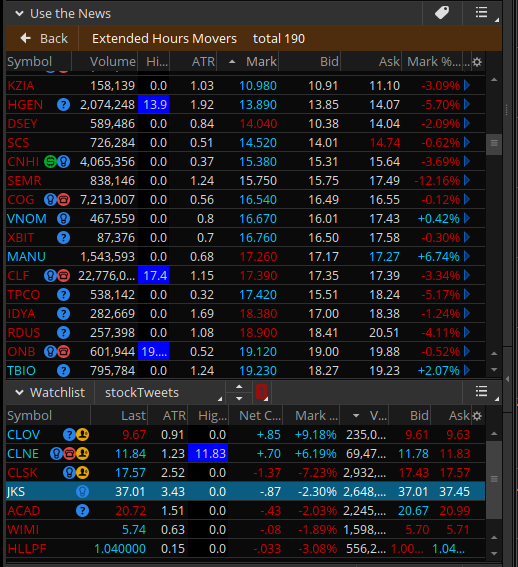
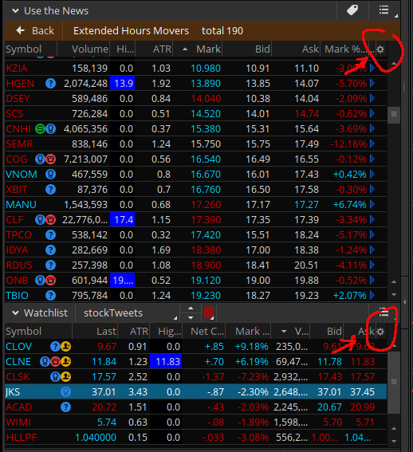
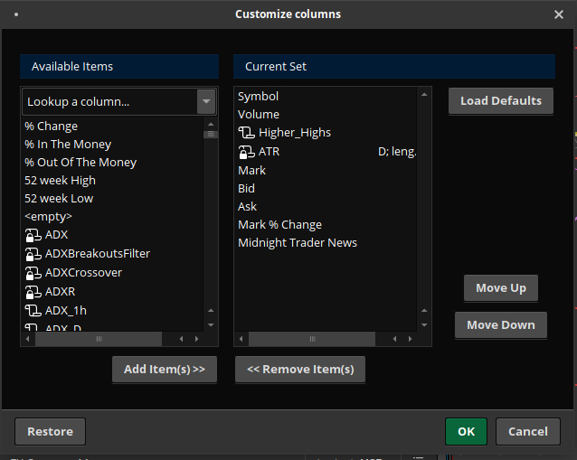

# Higher Highs  

*Discloser*: _In order to demonstrate the functionality of my script, I used actual symbol in the chart image. However, I do not make recommendations or determine the suitability of any security or strategy for individual traders. Any investment decision you make in your self-directed account is solely your responsibility._  

I wrote this for ThinkorSwim:registered: platform. It can be used for your watchlist. You can use this code [Higher_Highs](http://tos.mx/s67Uy9X) with TOS.  

Higher Highs checks the charts to see if the last 3 bars are closing higher.  This script was built for a watchlist.  

## How to Install  

To import the script code. Use the link above.  This will take you to the ThinkorSwim link and will explain how to install.  

### How to Use  

This script was written to be used with your watchlist. As you can see from the image below:   
I used this script with the Use the News window and with my Watchlist window. The blue boxes is displayed with the script detects a stock that is producing higher highs.  
To access the script to use in either Use the News or Watchlist. Click the gear icon at the upper right corner of the info bar.  Shown in the image below.   
This image shows where the gear icon is located on either window.  Once the gear icon is pressed you will be given the options to choose from. Click on Customize. This will display this new window as shown in this image below   
From this window you can add in the script.  On the Available Items column you will click in the box that says Lookup a column...  
This will allow you to type in what you are looking for.  Type in Higher_Highs - **Note that when you imported this script you had an option to change the name. Use that name you gave the script if you changed it.**  Once the script is available you will click on it to highlight the name.  Then click on the button labeled Add Item(s)>> at the bottom of the Available Items column.  This will move the name to the Current Set column.  From the image above you can see I have the name already in this column.  You can then move the name up or down in this column.  What this does is place the results of the script in the order you wish for it to be displayed.  Example would be like the image above that displays my In the News and Watchlist.  The script is in the third column and in the Customize Columns window in the Current Set column you can see that the script is the third from the top.  So another way to look at this is the top name will be to the far left in your display window - Either In the News or Watchlist - and so on.  

I hope this helped you get the script up and going and in the place you wanted it to be.  

### ThinkorSwim:registered: TOS  

You can download ThinkorSwim through TD Ameritrade:tm: at: [https://www.tdameritrade.com/tools-and-platforms.page](https://www.tdameritrade.com/tools-and-platforms.page)